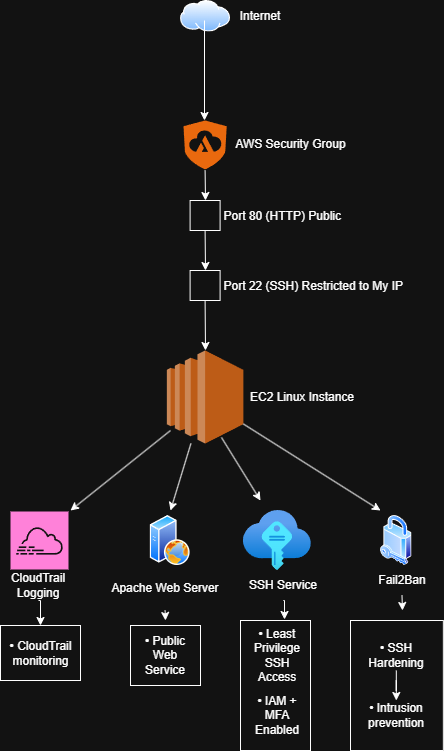

# AWS Cloud Security Lab

Designed and secured a vulnerable AWS EC2 environment to simulate real-world cloud security misconfigurations, monitoring, hardening, and intrusion prevention workflows.

## Architecture Diagram




# Security Incident Simulation

## Security Incident Scenario

An Amazon EC2 Linux instance was intentionally deployed with SSH (TCP/22) exposed to the public internet through an overly permissive AWS security group configuration.

### Initial Risk

The security group allowed inbound SSH access from:

```text
0.0.0.0/0
::/0
```

This configuration exposed the administrative SSH service to the entire internet and increased the attack surface of the cloud environment.

### Potential Threats

Potential risks associated with this configuration included:
- SSH brute-force attacks
- credential stuffing
- unauthorized administrative access
- automated internet scanning activity
- remote compromise attempts

### Investigation Activities

The following investigative actions were performed:
- validated public SSH exposure
- remotely connected to the EC2 instance
- monitored Apache web server logs
- investigated Linux SSH authentication logs
- analyzed failed login attempts
- reviewed CloudTrail audit activity

### Detection and Monitoring

Security monitoring capabilities implemented:
- AWS CloudTrail logging
- Apache access log monitoring
- SSH authentication log analysis
- Fail2Ban intrusion prevention

### Remediation Actions

The following remediation steps were implemented:
- restricted SSH access to a trusted public IP
- enabled MFA for AWS administrative access
- separated root and IAM administrative usage
- deployed Fail2Ban brute-force protection
- validated hardened SSH access controls

### Outcome

The environment was successfully hardened while maintaining secure administrative access and public web functionality.

# Skills Demonstrated

- AWS EC2 Administration
- AWS IAM Management
- AWS Security Groups
- CloudTrail Audit Logging
- Linux System Administration
- SSH Hardening
- Apache Web Server Deployment
- Linux Log Analysis
- Security Monitoring
- Brute-Force Detection
- Fail2Ban Intrusion Prevention
- MFA Configuration
- Cloud Security Hardening
- Incident Investigation
- Security Documentation


# Technologies Used

- Amazon Web Services (AWS)
- Amazon EC2
- AWS IAM
- AWS CloudTrail
- AWS CloudWatch
- Amazon SNS
- Linux (Amazon Linux 2023)
- Apache HTTP Server
- Fail2Ban
- SSH
- diagrams.net

# Key Security Improvements

- Restricted SSH access from public internet exposure
- Implemented least-privilege style administrative access
- Enabled MFA for privileged AWS accounts
- Deployed Fail2Ban intrusion prevention
- Configured CloudTrail audit logging
- Implemented CloudWatch monitoring and alerting
- Investigated authentication and web access logs
- Validated brute-force mitigation protections

# Lessons Learned

This project provided hands-on experience with:
- AWS cloud infrastructure
- security group hardening
- Linux server administration
- cloud-native monitoring
- intrusion prevention
- authentication logging
- defensive security operations
- incident investigation workflows

One important lesson learned was the importance of reducing public attack surface exposure while maintaining operational functionality.

