## Step 1: AWS Cost Safety Setup

Before deploying any cloud resources, I configured an AWS monthly budget alert to reduce the risk of unexpected charges during the lab.

- Region selected: us-east-1
- Budget type: Monthly cost budget
- Budget amount: $5
- Alert threshold: 80%
- Purpose: Cost control and safe Free Tier usage

### Screenshot

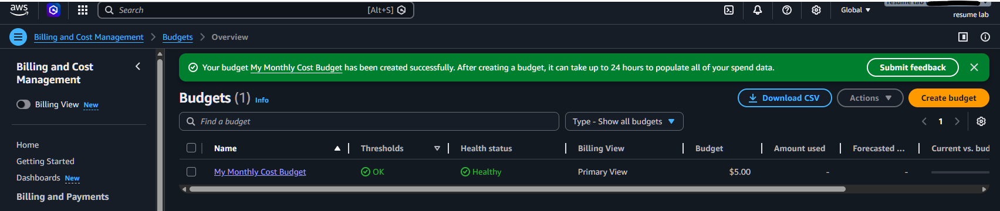


## Step 2: Deploying an Intentionally Vulnerable EC2 Instance

Created an Amazon EC2 Linux virtual machine using the AWS Free Tier.

### Configuration:
- AMI: Amazon Linux 2023
- Instance type: t2.micro (Free Tier eligible)
- Public IP enabled
- Security Group created for the lab

### Intentional Misconfiguration:
- SSH port 22 exposed to the public internet
- Inbound rule allowed traffic from:
  - 0.0.0.0/0
  - ::/0

### Purpose:
This simulates a common real-world cloud security issue where remote administrative access is exposed publicly.

### Screenshots

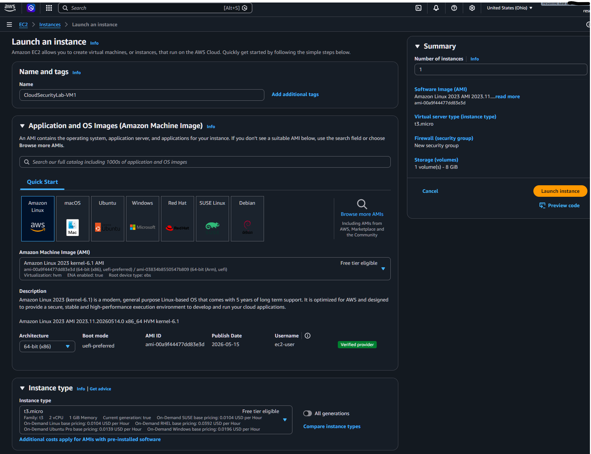

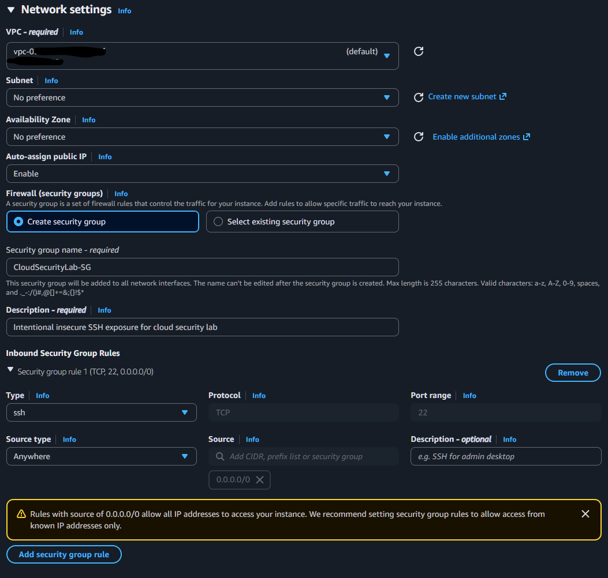

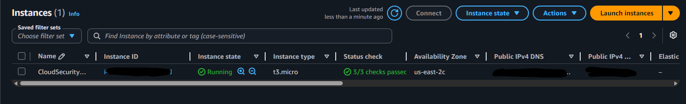


## Step 3: Validating Public SSH Exposure

Connected to the EC2 instance remotely using SSH and the generated private key pair.

### Commands used:
```bash
ssh -i CloudSecurityLab-Key.pem ec2-user@PUBLIC_IP
```

```bash
whoami
hostname
```

### Results:

Successfully established a remote shell session
Confirmed the VM was reachable from the public internet
Verified that SSH exposure on port 22 was functional

### Security Significance:
This demonstrates how publicly exposed administrative services can allow remote access attempts from anywhere on the internet.

### Screenshots

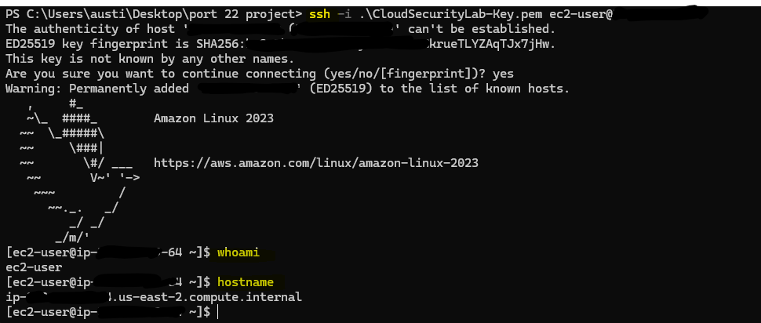

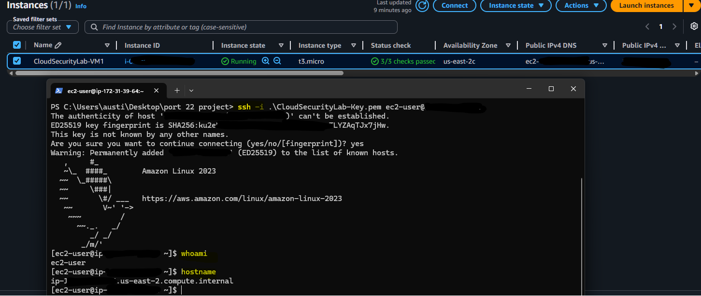


## Step 4: Investigating Public SSH Exposure

Reviewed the EC2 security group configuration and validated that the SSH service was publicly accessible.

### Findings:
- TCP port 22 was open to:
  - 0.0.0.0/0
  - ::/0
- This allowed inbound SSH traffic from anywhere on the internet.

### Validation:
Used PowerShell to confirm remote accessibility:

```powershell
Test-NetConnection PUBLIC_IP -Port 22
```

Result:

```powershell
TcpTestSucceeded : True
```

#### Additional Validation:
Verified that the SSH daemon was actively listening on port 22 inside the EC2 instance.

### Security Risk:
Public exposure of administrative services increases attack surface and may allow:

brute-force attacks
credential stuffing
unauthorized remote access attempts

### Screenshots

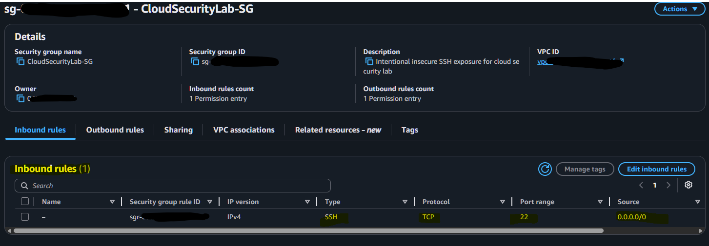

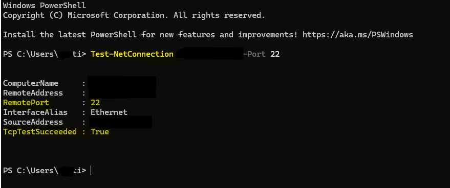

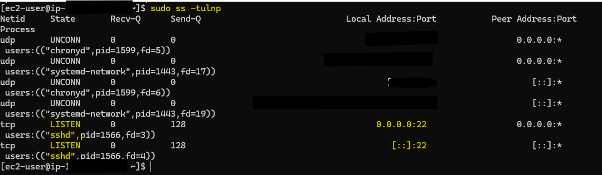


## Step 5: Remediating the Public SSH Exposure

Updated the EC2 security group to restrict SSH access.

### Previous Configuration
- SSH allowed from:
  - 0.0.0.0/0
  - ::/0

### Remediation
Modified the inbound SSH rule to allow access only from my public IP address using CIDR /32 notation.

Example:
```text
73.xx.xx.xx/32
```

### Validation
- Successfully reconnected to the EC2 instance after applying the restriction.
- Confirmed remote administrative access still functioned securely.

### Security Improvement
This reduced the internet-exposed attack surface and implemented least-privilege network access controls.

### Screenshots

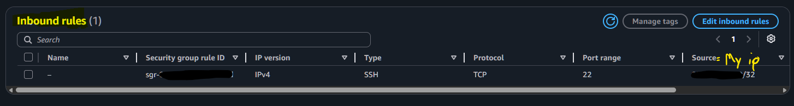

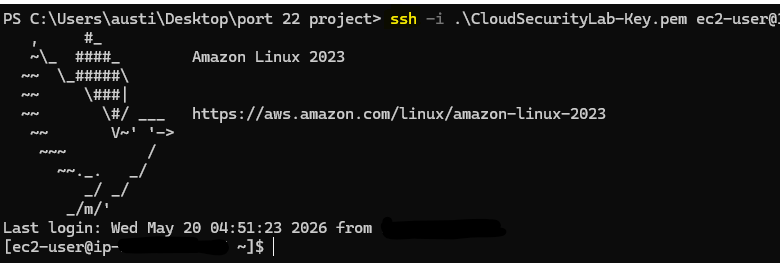


## Step 6: Enabling AWS CloudTrail Logging

Configured AWS CloudTrail to capture and monitor account activity.

### Configuration
- Trail Name: CloudSecurityLab-Trail
- Logging Scope:
  - Management Events
  - Read Events
  - Write Events

### Storage
CloudTrail automatically created an S3 bucket to store audit logs.

### Security Validation
Generated test activity by modifying the EC2 security group configuration.

### Observed Events
CloudTrail successfully recorded administrative actions including:
- security group modifications
- AWS console activity
- EC2-related actions

### Security Significance
CloudTrail provides centralized audit logging that supports:
- incident response
- forensic investigations
- compliance monitoring
- change tracking
- threat detection

### Screenshots

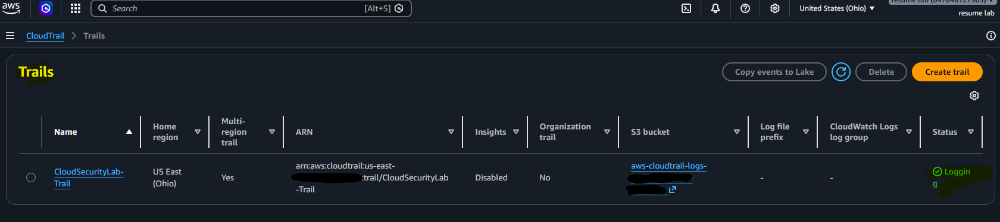

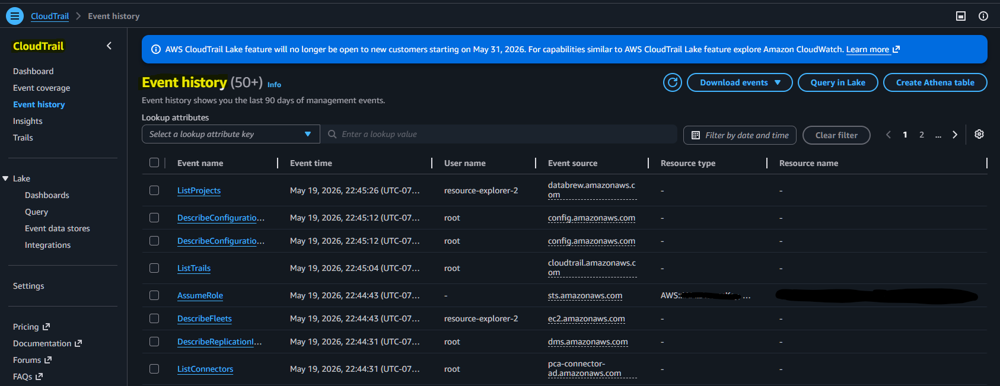


## Step 7: Deploying a Public Web Server

Installed and configured the Apache HTTP Server on the EC2 instance to simulate a public-facing cloud workload.

### Actions Performed

Updated the Linux system:
```bash
sudo dnf update -y
```

Installed Apache:
```bash
sudo dnf install httpd -y
```

Started and enabled the service:
```bash
sudo systemctl start httpd
sudo systemctl enable httpd
```

### Web Server Configuration

Created a custom test webpage:
```bash
echo "Cloud Security Lab - Public Web Server" | sudo tee /var/www/html/index.html
```

### Network Configuration

Modified the EC2 security group to allow:
- HTTP traffic on port 80
- Public inbound access from:
  - 0.0.0.0/0

SSH access remained restricted to my public IP only.

### Validation

Successfully accessed the web server externally using the EC2 public IP address through a web browser.

### Security Significance

This simulated a realistic internet-facing cloud workload while maintaining restricted administrative access controls.

### Screenshots

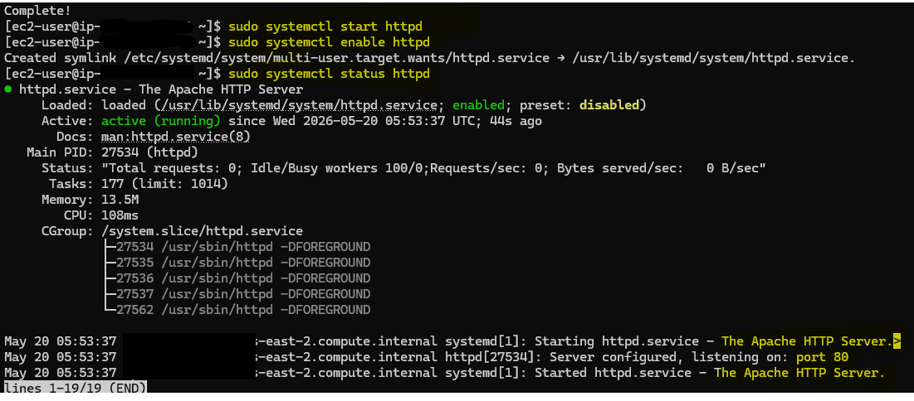

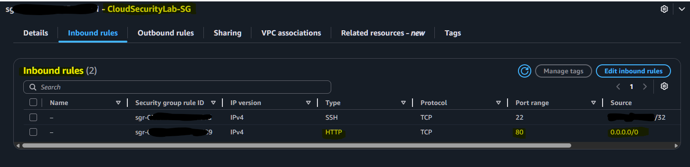

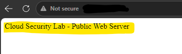


## Step 8: Analyzing Web Server Logs

Generated simulated reconnaissance traffic against the public web server and analyzed Apache access logs.

### Simulated Requests

Accessed:
- /
- /admin
- /login

These requests simulated basic enumeration activity commonly observed against internet-facing systems.

### Log Monitoring

Used the following command to monitor Apache logs in real time:

```bash
sudo tail -f /var/log/httpd/access_log
```

### Log Analysis

Filtered failed web requests using:

```bash
sudo grep "404" /var/log/httpd/access_log
```

### Observations

Observed:
- successful HTTP 200 responses
- HTTP 404 errors for nonexistent pages
- client source IP addresses
- timestamps and request methods

### Security Significance

This demonstrated how defenders can:
- monitor public-facing services
- detect suspicious requests
- investigate web activity
- analyze reconnaissance behavior

### Screenshots

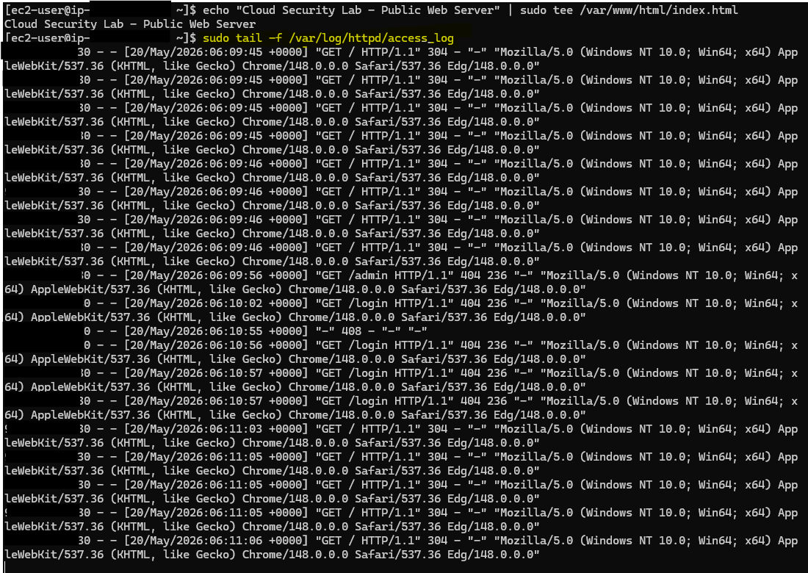

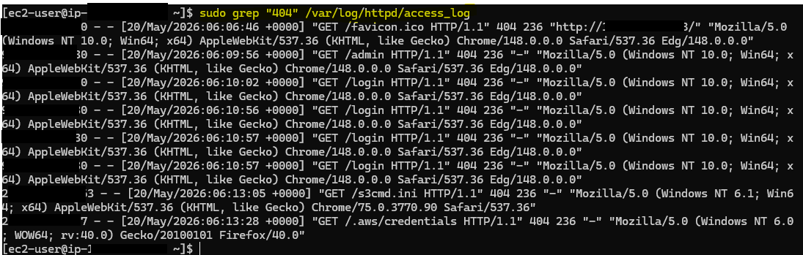


## Step 9: Investigating Failed SSH Authentication Attempts

Simulated unauthorized SSH login attempts against the EC2 instance and analyzed Linux authentication logs.

### Simulated Activity

Generated failed SSH login attempts using invalid usernames:

```bash
ssh fakeuser@PUBLIC_IP
ssh admin@PUBLIC_IP
```

### Log Monitoring

Monitored SSH authentication logs in real time:

```bash
sudo journalctl -u sshd -f
```

### Log Analysis

Filtered authentication events using:

```bash
sudo journalctl -u sshd | grep "Invalid user"
sudo journalctl -u sshd | grep "Failed"
```

### Observations

Observed:
- failed SSH authentication attempts
- invalid user login activity
- source IP addresses
- SSH daemon logging events

### Security Significance

This demonstrated:
- Linux authentication monitoring
- brute-force detection concepts
- SSH attack visibility
- defensive log analysis techniques

### Screenshots

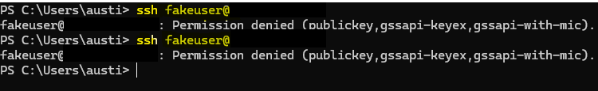

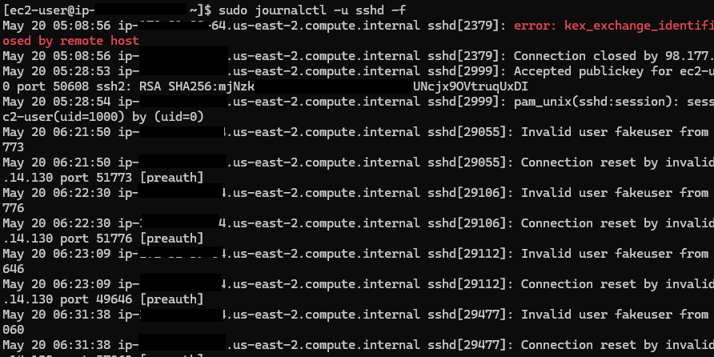

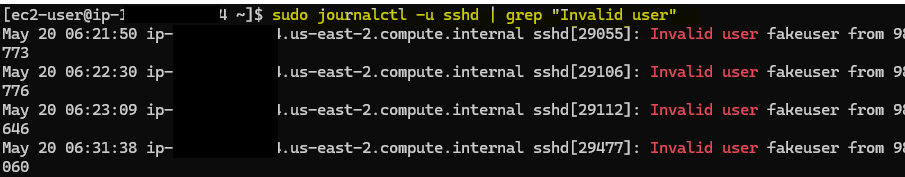


## Step 10: Implementing Automated SSH Attack Protection with Fail2Ban

Installed and configured Fail2Ban to detect and block repeated failed SSH authentication attempts.

### Installation

Installed Fail2Ban and required repositories:

```bash
sudo dnf install epel-release -y
sudo dnf install fail2ban -y
```

### Configuration

Created a custom SSH protection policy:

```ini
[sshd]
enabled = true
port = 22
logpath = %(sshd_log)s
backend = systemd
maxretry = 3
findtime = 10m
bantime = 15m
```

### Service Management

Enabled and started the Fail2Ban service:

```bash
sudo systemctl enable fail2ban
sudo systemctl start fail2ban
```

### Validation

Verified:
- the Fail2Ban service was active
- the SSH jail was monitoring authentication events
- automated blocking protections were enabled

### Security Significance

This implemented automated intrusion prevention capabilities against:
- SSH brute-force attacks
- repeated authentication failures
- unauthorized remote access attempts

### Screenshots

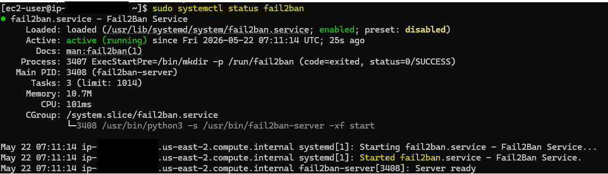

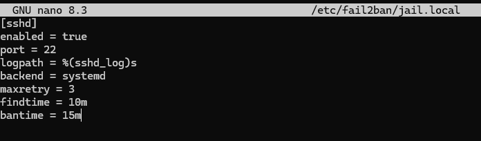

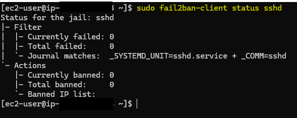


## Step 11: Simulating and Blocking SSH Brute-Force Activity

Simulated repeated failed SSH authentication attempts to validate Fail2Ban intrusion prevention controls.

### Attack Simulation

Generated multiple failed login attempts using invalid usernames:

```bash
ssh invaliduser@PUBLIC_IP
```

### Detection and Response

Fail2Ban detected repeated authentication failures and automatically:
- identified the offending source IP
- added the IP to the banned list
- blocked additional SSH connection attempts

### Validation Commands

Checked Fail2Ban monitoring status:

```bash
sudo fail2ban-client status sshd
```

Optional unban operation:

```bash
sudo fail2ban-client set sshd unbanip PUBLIC_IP
```

### Observations

Observed:
- automated detection of brute-force behavior
- active IP banning
- blocked SSH connectivity after repeated failures

### Security Significance

This demonstrated:
- intrusion prevention
- automated defensive response
- brute-force mitigation
- SSH hardening validation

### Screenshots

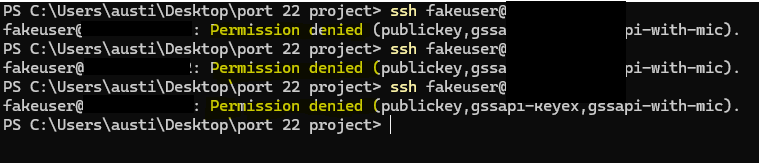

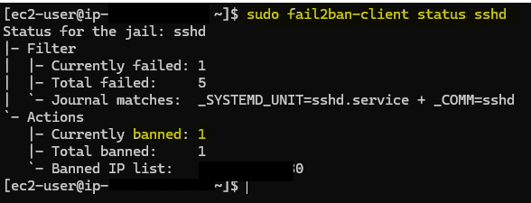

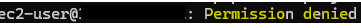


## Step 12: Implementing IAM Administrative Access

Created a dedicated AWS IAM administrative user to avoid daily use of the root account.

### IAM User Configuration

Created IAM user:
```text
cloud-security-admin
```

Enabled:
- AWS Management Console access
- password-based authentication

### Permissions

Assigned:
```text
AdministratorAccess
```

### Security Purpose

This separated administrative activity from the AWS root account and implemented identity-based access management practices.

### Validation

Successfully authenticated into AWS using the IAM user account instead of the root account.

### Security Significance

This demonstrated:
- AWS Identity and Access Management (IAM)
- administrative account separation
- cloud access control concepts
- foundational least privilege practices

### Screenshots

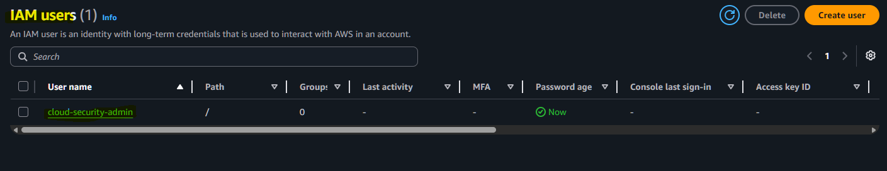

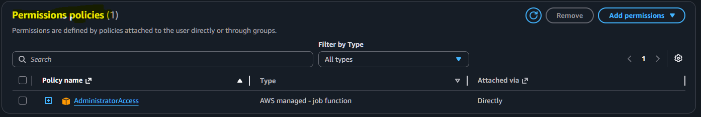

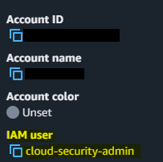


## Step 13: Enabling Multi-Factor Authentication (MFA)

Configured MFA protection for the AWS IAM administrative account.

### MFA Configuration

Assigned a virtual MFA device using an authenticator application.

Supported:
- time-based one-time password (TOTP)
- rotating authentication codes

### Validation

Successfully authenticated into AWS using:
- username/password
- MFA verification code

### Security Significance

This implemented additional identity protection against:
- credential theft
- password compromise
- unauthorized administrative access

### Security Controls Demonstrated

- privileged account hardening
- identity security
- AWS IAM protection
- multi-factor authentication enforcement

### Screenshots

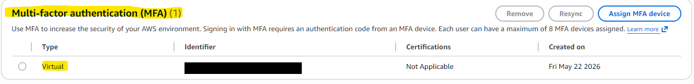


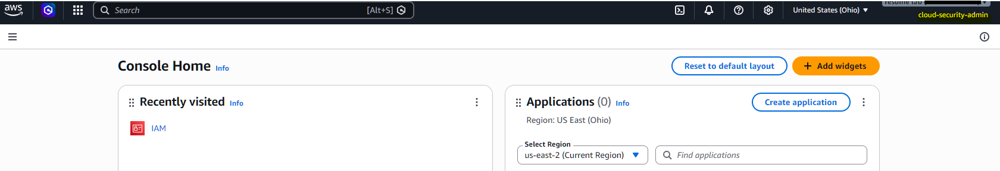


## Step 14: Creating Cloud Security Architecture Documentation

Created a visual architecture diagram documenting the AWS cloud security lab environment.

### Components Included

- Internet-facing EC2 instance
- AWS Security Group controls
- Restricted SSH administrative access
- Public HTTP web service
- Apache web server
- Fail2Ban intrusion prevention
- CloudTrail audit logging
- IAM administrative access
- MFA security controls

### Security Architecture Highlights

- SSH restricted to a single trusted IP
- Public-facing web service isolated through security group rules
- Authentication monitoring and brute-force protection enabled
- AWS administrative actions audited through CloudTrail
- MFA enforced for administrative access

### Documentation Purpose

The architecture diagram provides:
- infrastructure visibility
- security control mapping
- attack surface visualization
- professional project documentation

### Screenshots

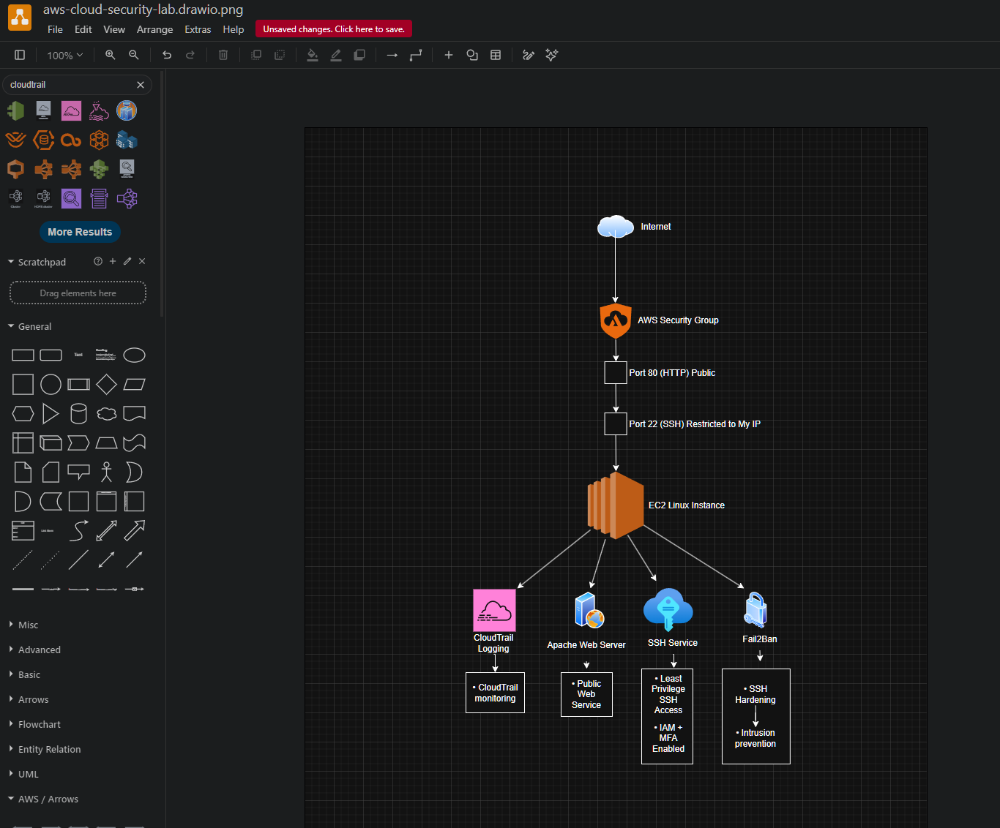

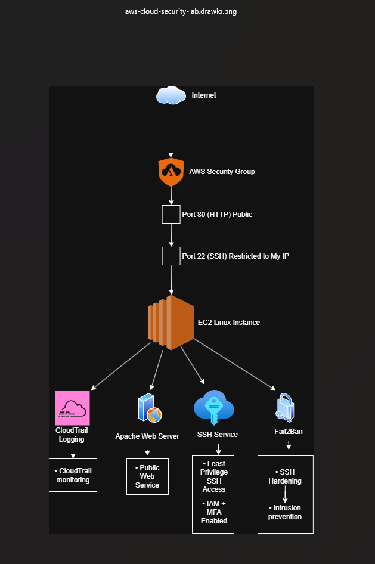


## AWS Service Availability Observation

While attempting to enable Amazon GuardDuty, the AWS account displayed an account setup limitation message despite EC2, IAM, CloudTrail, and other services functioning normally.

### Observation

GuardDuty access was restricted due to AWS account activation or plan-state limitations during the initial account setup period.

### Troubleshooting Performed

- Verified billing configuration
- Confirmed payment method was added
- Tested access using both root and IAM administrative accounts
- Reviewed AWS account setup workflow

### Outcome

The project continued using alternative AWS-native monitoring and security tooling while documenting the service availability limitation.

### Security Engineering Relevance

This reflects a realistic cloud engineering scenario where account restrictions, service availability, or platform limitations may impact deployment planning and security tooling access.


## Step 17: Implementing CloudWatch Monitoring and Alerting

Configured AWS CloudWatch monitoring and alerting for the EC2 instance.

### Monitoring Configuration

Monitored EC2 metrics including:
- CPUUtilization
- network activity
- instance performance telemetry

### Alert Configuration

Created a CloudWatch alarm with:
- Metric: CPUUtilization
- Threshold: Greater than 20%
- Notification Service: Amazon SNS email alerts

### Validation

Simulated elevated CPU usage using stress-generating processes:

```bash
yes > /dev/null &
```

Observed:
- increased CPU utilization
- CloudWatch alarm state transition
- SNS email alert delivery

### Recovery

Stopped the simulated CPU load using:

```bash
pkill yes
```

### Security Significance

This demonstrated:
- cloud infrastructure monitoring
- alerting workflows
- operational visibility
- anomaly detection concepts
- automated notification systems

### Screenshots

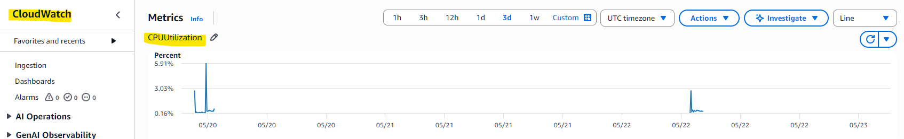

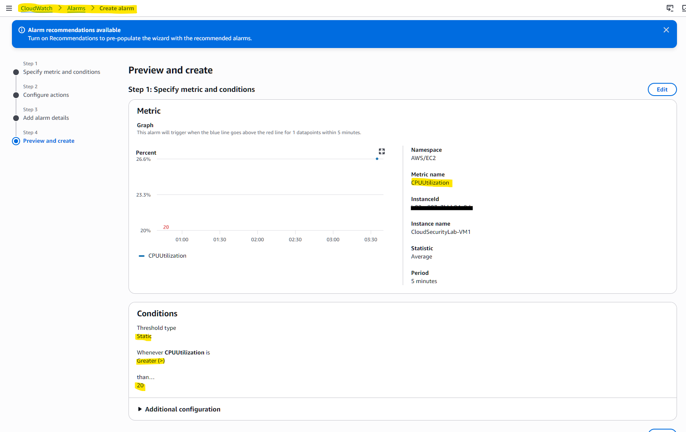

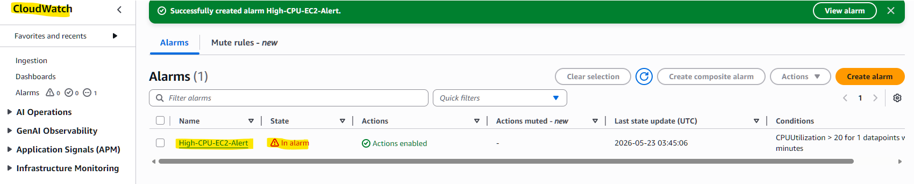

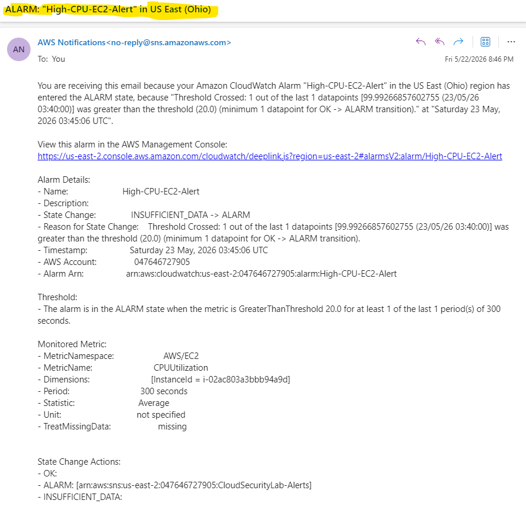


## Step 18: Finalizing the Cloud Security Project Repository

Organized the project into a professional GitHub repository structure.

### Repository Improvements

Implemented:
- structured documentation folders
- screenshot organization
- architecture diagram storage
- README enhancements
- sensitive file exclusions

### Security Protections

Created a `.gitignore` file to prevent accidental exposure of:
- SSH private keys
- credential files
- environment configuration files

### Documentation Enhancements

Expanded project documentation to include:
- technologies used
- lessons learned
- security improvements
- incident simulation details

### Final Outcome

The project repository was finalized as a professional cloud security portfolio project demonstrating:
- AWS cloud security
- Linux administration
- monitoring and alerting
- security hardening
- defensive operations
- incident investigation

## Step 19: Cloud Resource Cleanup and Cost Control

Performed final AWS resource cleanup to prevent unnecessary cloud charges and safely decommission the lab environment.

### Resources Removed

- Terminated EC2 instance
- Deleted CloudWatch alarms
- Deleted SNS notification topics
- Removed CloudTrail resources and associated storage (optional)

### Billing Review

Reviewed AWS Billing and Cost Management dashboards to verify:
- minimal resource usage
- no unintended active infrastructure
- Free Tier cost control

### Security and Operational Significance

This demonstrated:
- cloud resource lifecycle management
- operational cleanup procedures
- cost-awareness practices
- secure decommissioning workflows

### Final Outcome

The cloud security lab environment was successfully:
- deployed
- secured
- monitored
- investigated
- documented
- safely decommissioned
